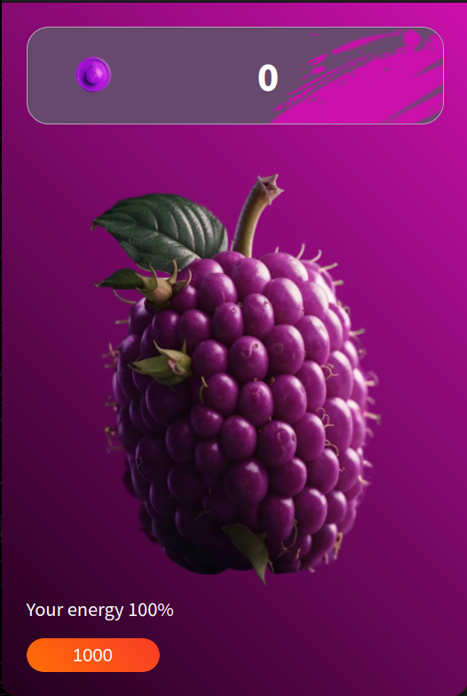

# test_ItWorkin

## 🌟 Описание проекта

- **Баланс и энергия**: Следите за балансом и уровнем энергии в реальном времени.
- **Клик по фрукту**: Нажимайте на фрукт, чтобы увеличить баланс на 1 монету, и наблюдайте за эффектными анимациями.
- **Мультитап**: Используйте несколько пальцев для увеличения монет (+2 при двух пальцах, +3 при трёх пальцах).
- **Автофарм**: Баланс увеличивается автоматически на 1 монету каждую секунду.
- **Восстановление энергии**: Энергия автоматически восстанавливается на 1 единицу в секунду, чтобы вы могли продолжать играть.
- **Анимации**: Наслаждайтесь плавными анимациями нажатия на фрукт и восстановления энергии.

# Bot: @clickerFruit_bot


## Стек технологий: React, TypeScript, Vite, SCSS, Material-UI, Prettier

## Инструкция по запуску проекта

1. **Клонирование репозитория**
   ```bash
   git clone https://github.com/dg44k/test_ItWorkin.git

2. **Перейти в папку с репозиторием**
   ```bash
   cd test_ItWorkin

3. **Установка зависимостей**
   ```bash
   npm install

4. **Запуск приложения**
   ```bash
   npm run dev


